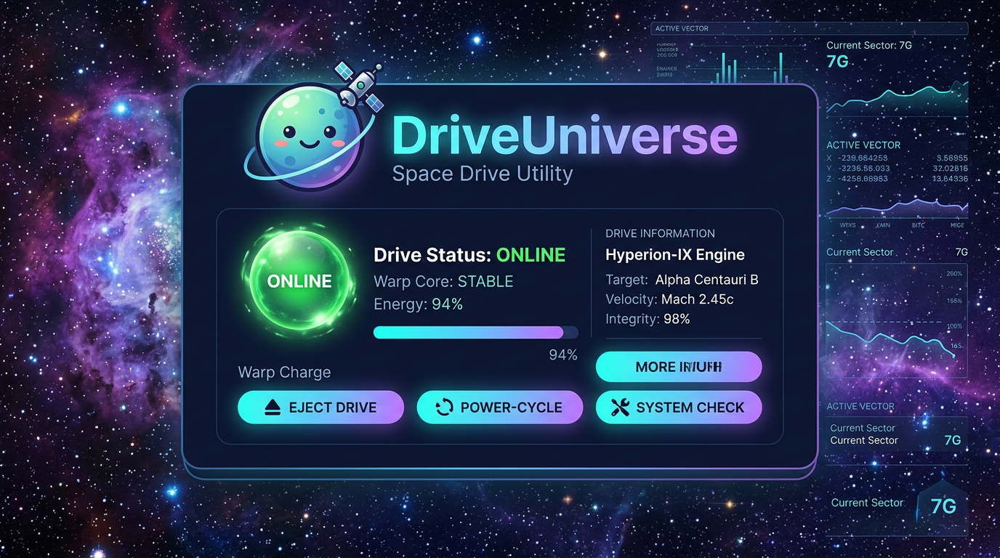

# 🪐 DriveUniverse



**Orbit your drives — eject, power-cycle, automate, and command by voice.**

A Windows drive-control utility that turns managing external USB drives (WD My Book, SSDs, flash drives) into something beautiful and effortless. Built with a deep-space aesthetic, an animated mascot, cinematic transitions, and fully offline voice control.

---

## 👋 Why I Built This

You might be here because you run a (hybrid Windows) home server, manage multiple external drives, or simply want more control without crawling behind your desk to unplug things.

I built DriveUniverse because I needed it. My media server required reliable drive management — mounting what I need, when I need it, without juggling five different applications. The tools that existed were either too basic, couldn't mount ejected drives properly, too manual, or simply uninspiring to use. I wanted something that was fast, integrated, and genuinely enjoyable to interact with.

Until I discovered how to trick Windows. DriveUniverse is that tool. It serves as a nexus — link your disk utilities, automate power cycling, and control everything by voice. Say *"Orbit, eject drive"* and it's done. Say *"Orbit, connect drive"* and your hardware spins back up. No menus, no Device Manager, no replugging cables.

I'm a developer who values having full control over software. Honestly, I was hesitant about AI — I believe it can reduce critical thinking and comes with an environmental cost. But I also had a vision I wanted to ship, and translating ideas into a polished product takes time I didn't have. So for the first time, I used an agentic AI to accelerate development. The architecture, the ideas, the design decisions, the dozens of iterations refining every detail — those are mine. The AI was a tool, not a replacement. It still took extensive back-and-forth to get every interaction right.

The result is something I'm proud of. If you're skeptical about AI-assisted development, I understand. But judge the software, not how it was made. Give it a try.

**Enjoy a software like never before.**

> 💡 **Quick start:** Tap Orbit in the tray window to pop up the floating widget. Say *"Orbit"* when voice is active to get verbal feedback that the system is listening.

---

## ⬇️ Download

**Don't want to build from source?** Download the ready-to-run exe from the [latest release](../../releases/latest).

**Want to compile it yourself?** Download the source (ZIP) and run `build-and-run.bat`. Requires [.NET 8 SDK](https://dotnet.microsoft.com/download).

---

## ✨ Features

### Drive Control
- **Safe eject** — uses the official Windows Safely Remove API (`CM_Request_Device_Eject`)
- **Power-cycle / wake** — brings an ejected drive back online using SetupAPI (the exact method Device Manager uses)
- **Blocker detection** — shows exactly which processes are holding the drive open (Restart Manager API)
- **System drive protection** — C: can never be accidentally ejected
- **Drive tracking** — remembers which drive you ejected so it stays selected (works with multiple USB drives)

### Voice Control (fully offline, no cloud)
- **Wake word** — say *"Orbit"* to activate, then speak your command within 8 seconds
- **Drive commands** — *"Eject drive"*, *"Connect drive"*, *"Mount"*, *"Power down"*
- **Open apps** — *"Open Defraggler"* — launches any linked application
- **Confirmation flow** — destructive actions ask *"yes"* or *"no"* before executing
- **Status check** — *"Drive status"* reports current state
- **Help** — *"Help"* or *"What can you do"* opens the command reference
- **Privacy** — uses Windows SAPI5, no audio ever leaves your PC

<details>
<summary>📹 Voice demos (click to expand)</summary>

**App Voice Showcase**


**App Eject Drive with Voice Confirmation**


</details>

### Floating Widget
- **Draggable desktop widget** — Orbit lives wherever you place it, always accessible
- **Quick eject / mount** — buttons appear on hover for one-click drive control
- **Radial app launcher** — hover to see linked app icons arranged in a ring
- **Mini animations** — eject plays a departure effect, mount plays a warp burst
- **Voice feedback** — command text appears below with green/red ring pulse

<details>
<summary>📹 Widget demos (click to expand)</summary>

**Orbit Widget — Quick Actions**


**Orbit Widget — Eject (with failed attempt)**


**Orbit Widget — Engage, Power, and Mount**


**Orbit Widget — Opening an App**


**Orbit Commands Help Window**


</details>

### Automation Rules
- **Idle auto-eject** — eject the drive after N minutes of no activity
- **Auto power-cycle** — wake the drive on a schedule
- **Auto-quit processes** — terminate recurring blockers before ejecting
- **Per-rule control** — enable or disable each rule independently

<details>
<summary>📹 Rules demo (click to expand)</summary>


</details>

### UI & Polish
- **Deep-space theme** — animated starfield with nebula background
- **Vector mascot "Orbit"** — blinks, breathes, looks around, reacts to events
- **Cinematic transitions** — eject = planet departs into the void, connect = lightspeed warp
- **Glass-morphic panels** — translucent cards with glow and depth
- **Page transitions** — smooth fade + slide between tabs
- **Embedded sound design** — confirm chimes, connect sweep, disconnect tone
- **Drive activity radar** — real-time read/write visualization
- **Dev console** — raw text interface for power users and debugging

<details>
<summary>📹 App demos (click to expand)</summary>

**App Eject (with cinema animation)**


**App Engage and Mount External Drive**


**App Settings**


**App Apps (linking external tools)**


**Dev Console (with error explanations)**


</details>

---

## 📦 Build

Requires **.NET 8 SDK**.

```bat
dotnet build -c Release
```

Run `bin\Release\net8.0-windows\DriveUniverse.exe` (UAC prompt for admin — required for device operations).

**Single-file standalone exe** (no .NET install needed on target machine):

```bat
publish-single.bat
```

Or use one-click build scripts:
- `build-and-run.bat` — builds and launches
- `build-fresh.bat` — clears all user data, builds clean, launches

---

## 🔧 Requirements

- **Windows 10/11** (x64)
- **.NET 8 runtime** (or build self-contained with `publish-single.bat`)
- **Administrator rights** (for eject/disable/enable — same permissions as Device Manager)
- **Optional:** Windows Speech Recognition installed
  - Settings → Time & Language → Speech → Add voices (e.g., English US)
  - This enables voice commands. The app works fully without it.

---

## 🗂️ Architecture

| Layer | What |
|---|---|
| `Win32.cs` | P/Invoke: Restart Manager + Configuration Manager |
| `SetupApi.cs` | SetupAPI interop (device disable/enable via class installer) |
| `DriveService.cs` | Core logic: eject, power-cycle, blockers, status, enumeration |
| `Voice/VoiceCommandService.cs` | Offline speech recognition + synthesis with wake word |
| `Services/` | Sound, app launcher, process monitor, rule engine, icon extraction, tipping |
| `Controls/` | Mascot, starfield, warp overlay, activity radar, logo, command help |
| `Views/` | Drive control, processes, rules, apps, voice, settings, dev console |
| `OrbitWidget` | Floating desktop widget with mini animations |
| `MainWindow` | Tray popup, navigation, voice routing, widget management |

---

## 🎯 How It Works (Under the Hood)

### Eject
Uses `CM_Request_Device_EjectW` — the exact API behind Windows "Safely Remove Hardware." If the eject is blocked, the app uses the Restart Manager (`RmRegisterResources` / `RmGetList`) to identify exactly which process is holding the drive open and reports it to the user.

### Power-cycle (wake)
Uses `SetupDiCallClassInstaller` with `DIF_PROPERTYCHANGE` + `DICS_DISABLE` / `DICS_ENABLE` — the exact method Device Manager uses when you right-click → Disable → Enable. This properly clears Code 47 (prepared for safe removal) and forces the USB port to re-enumerate, spinning the drive back up.

### Voice
Uses `System.Speech` (SAPI5) with a single grammar containing all commands and linked app names. Wake word mode uses a code-level state machine (no fragile grammar hot-swapping). Confidence threshold of 0.80+ (0.93 for single words) prevents false triggers from background noise.

---

## 📝 License

Copyright (c) 2026 **PN379**. See [LICENSE](LICENSE) for full terms.

Key points:
- **Free to use** for personal, educational, and commercial purposes
- **No warranty** — provided "AS IS" with no liability
- **No responsibility for misuse** — author is not liable for data loss, hardware damage, or illegal use
- **Acceptable use clause** prohibits use for circumventing security, unauthorized access, or illegal activities

---

## 🙏 Credits

Created by **PN379** ([github.com/PN379](https://github.com/PN379))

> ♥ Found this useful? There's a **"Support DriveUniverse"** button here [](https://ko-fi.com/firedell)
and in the App Settings.

*This is beta software. Test thoroughly before relying on it for important data. Always back up your drives.*
